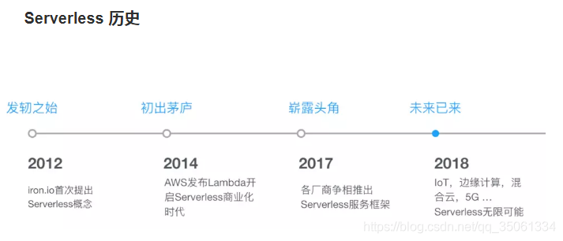

# serverless介绍

## 一、起源

Serverless 这个词第一次被使用大约是 2012 年由 Ken Form 所写的一篇名为《Why The Future of Software and Apps is Serverless》的文章。这篇文章谈到的内容是关于持续集成及源代码控制等内容，并不是我们今天所特指的这一种架构模式。Amazon 在 2014 年发布的 AWS Lambda 让“Serverless”这一范式提高到一个全新的层面，为云中运行的应用程序提供了一种全新的系统体系结构。至此再也不需要在服务器上持续运行进程以等待 HTTP 请求或 API 调用，而是可以通过某种事件机制触发代码的执行，通常这只需要在 AWS 的某台服务器上配置一个简单的功能。此后 Ant Stanley 在 2015 年 7 月的名为《Server are Dead…》的文章中更是围绕着 AWS Lambda 及刚刚发布的 AWS API Gateway 这两个服务解释了他心目中的 Serverless，“Server are dead…they just don’t know it yet”。到了 2015 年 10 月份，在那一年的 AWS re:Invent 大会上，Serverless 的这个概念更是反复出现在了很多场合。印象中就包括了“（ARC308）The Serverless Company Using AWS Lambda”及“（DVO209）JAWS: The Monstrously Scalable Serverless Framework”这些演讲当中。随着这个概念的进一步发酵，2016 年 10 月在伦敦举办了第一届的 Serverlessvconf。在两天时间里面，来自全世界 40 多位演讲嘉宾为开发者分享了关于这个领域进展。

## 二、简介

> serverless (无服务器体系结构)是包含第三方“后端即服务”（BaaS）服务和/或包含在“功能即服务”（FaaS）平台上的托管临时容器中运行的自定义代码的应用程序设计。通过使用这些思想以及诸如单页应用程序之类的相关思想，这样的体系结构消除了对传统的永远在线服务器组件的大量需求。

> serverless (无服务器体系结构)是一种在云中构建系统的新方法。
它集成了后端即服务（BaaS）—由供应商托管，高度可扩展的数据和逻辑组件，可满足我们对数据库，消息传递平台，用户管理等的需求。此外，无服务器架构还包括功能即服务（FaaS），即以事件触发的小型功能编写自定义服务器端软件的功能，该功能部署到完全托管的平台中。FaaS将所有部署，资源分配和配置，扩展，操作系统维护和过程监控外包。

## 三、特性

1.不需要管理服务器主机或服务器进程
2.根据负载自动缩放和自动配置
3.根据精确用法提供费用
4.具有除主机大小/数量之外的其他性能定义
5.具有隐式的高可用性

## 四、发展

### 1.国外

2014 年 AWS 推出了 lambda 服务，把 Serverless 产品化，并收到了很好的效果，微软、Google 和 IBM 看到后，也分别在 2016 年推出了自己的 Serverless 产品：Azure function、GCP 和 OpenWisk。

### 2.国内

- 阿里云和腾讯云也分别在 2017 年推出了自己的 Serverless 产品，腾讯云要早阿里云一天推出。
- 2017 年华为云推出自己首个 serverless 产品 FunctionStage

### 3.开源

- 1.Fission: Fission是Kubernetes上无服务器功能的框架
- 2.LambCI: 基于 AWS Lambda 的持续集成工具。
- 3.Serverless：纯开发工具，和云平台以及开源的 FaaS 平台整合，方便开发者把自己的 Function 部署到不同的云平台。目的是通过代码框架来弥合不同的 FaaS 提供方的差异。
- 4.aws-lambda-go-shim: 让 AWS Lambda 支持 go function。思路是通过 c 给 python 写个扩展，然后通过 cgo 和 go 整合起来。
- 5.Apex: 打包部署和管理 AWS Lambda。
- 6.StackStorm 准确的说它不是 FaaS，而是事件驱动的自动化运维工具。但本质上二者的目标是一致的。
- 7.Leveros 目标是通过 Docker 打造一个面向 serverless 微服务的云平台，并且试图将服务间的 RPC 调用透明化。
- 8.Stdlib 试图打造基于 FaaS 微服务的标准库，并提供一个 Function 的注册仓库。

## 小结

serverless还算是一个新兴落地的概念，提出来好几年了，打地基的时代刚过，现在还是一片红海就已经让各大厂商打的头破血流了，本篇都是说明它宏观上的体现以及一些简单的概念，接下来我会阐述一下它对使用者的意义。

因为水平有限，错漏之处请大家不吝指正，谢 :)

## 引用和一些学习链接

- 1.[从IaaS到FaaS—— Serverless架构的前世今生-费良宏](https://amazonaws-china.com/cn/blogs/china/iaas-faas-serverless/)
- 2.[Defining Serverless-Mike Roberts](https://blog.symphonia.io/posts/2017-06-22_defining-serverless-part-1)
- 3.[Serverless Architectures-Mike Roberts](https://martinfowler.com/articles/serverless.html#origin)
- 4.[Why The Future Of Software And Apps Is Serverless - ken fromm](https://readwrite.com/2012/10/15/why-the-future-of-software-and-apps-is-serverless/?__cf_chl_jschl_tk__=11eb23b4e0f10d2a0b8808ea80896ab60d9bf394-1607152759-0-AYyWKX4iQgO8eRIRJtFEklUxg6r1_MOeWp1D2fPkTlkCbZdZ-or6TdSuDYSFFFFU4ksDQ7YDfO1DeaeML7c86OAVATgAL_V39E4vlOgk2Xtp04EZwaNctjWx4L1sbN3AKDgyOjN9qpZN6jVxGKfdPyYx3EkxuwY_G0Uju--mLktGcNWzCFBU7AuhIAVa1aym17764rqCnMJ4skuqOpuwyj8XJyzwf1-sFVwxwxXbxKOjmJ4ETF_xuIqUUE7tvrHu94sVl_UIbAoOD7vbO0mgZIlVovO0imOKzeSdRk5iUKgw5V8e0LPALF3JTjAZM9U0C1CyC2ZkwfV_zKBctoUoPwMREpjeOwqMaa0lQjZb5bNscaK3FsSkM0I7rNExRZOhKiAj8i5BuR9QlmHwnZMBZK73Kan_sKaVAeUawzq6weqlMDihXaRLcpHzKvDLVs3ZHg)
- 5.[无服务器化一“触”即发！华为云Serverless产品FunctionStage正式公测](https://www.sohu.com/a/197919834_99925426)
- 6.[腾讯云 Serverless 技术演进](https://blog.csdn.net/weixin_42409476/article/details/100682590)
- 7.[【serverless】各大厂商的无服务计算平台简单介绍和对比](https://blog.csdn.net/qq_35061334/article/details/104328850)
- 8.[无服务器Serverless总结](https://blog.csdn.net/qq_35061334/article/details/97290306)
- 9.[知乎serverless话题简介](https://www.zhihu.com/topic/20086226/intro)
